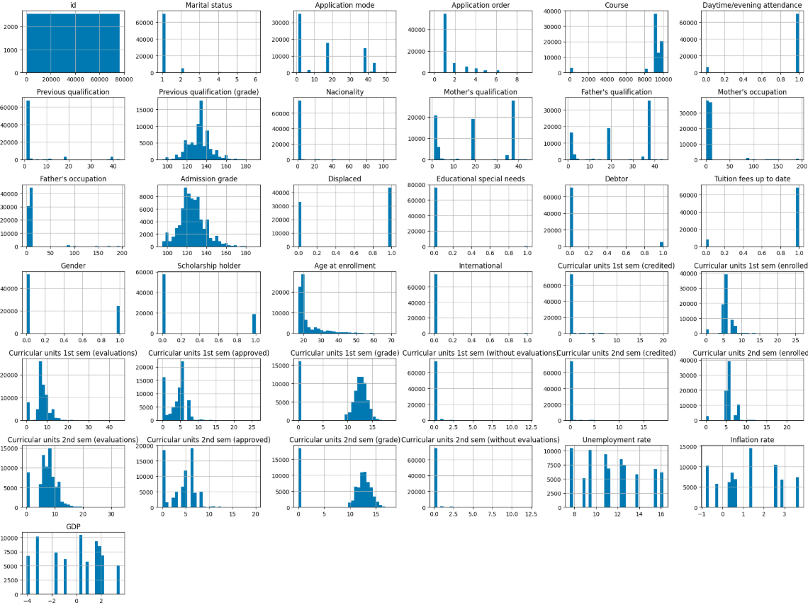
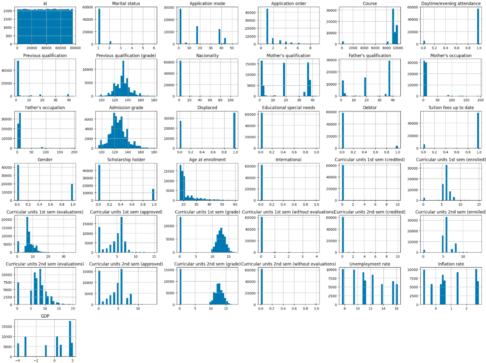
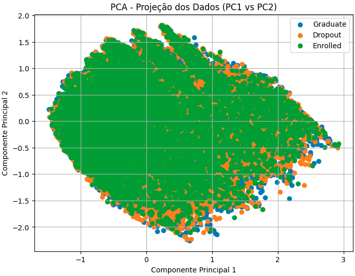

# Classificação com MLP


## Grupo

1. Eduardo Selber Castanho
2. Henrique Fazzio Badin
3. Lucas Fernando de Souza Lima


## 1. Dataset Overview

**Dataset:** [Predict Students' Dropout and Academic Success](https://archive.ics.uci.edu/dataset/697/predict+students+dropout+and+academic+success)  
**Fonte:** UCI Machine Learning Repository  
**Domínio:** Educação / Ciências Sociais  
**Tipo de dados:** Tabular (numéricos, categóricos e inteiros)  
**Tarefa:** Classificação multiclasse (3 classes: *dropout*, *enrolled*, *graduate*)  
**Amostras:** 4.424  
**Features:** 36  
**Descrição:**  
Dados de estudantes de graduação em diversas áreas, contendo informações demográficas, socioeconômicas e de desempenho acadêmico nos dois primeiros semestres. O objetivo é prever a situação final do aluno — evasão, matrícula ativa ou graduação.  

**Motivação:** O **Predict Students' Dropout and Academic Success** foi escolhido por ser também utilizado em uma [competição no Kaggle](https://www.kaggle.com/competitions/academic-success-classifier/data), o que reforça sua relevância e permite comparações de desempenho entre diferentes abordagens de classificação.  

Além disso, trata-se de um tema **socialmente importante**, pois os resultados obtidos podem ser aplicados em **escolas, universidades e instituições educacionais** para identificar precocemente alunos com risco de evasão e orientar estratégias de apoio acadêmico.  

O dataset é **robusto** (mais de 4.000 instâncias e 36 variáveis) e, ao mesmo tempo, **bem estruturado**, com dados **limpos e sem valores ausentes ou duplicados**, além de **descrições claras das features**, o que facilita o desenvolvimento e análise de modelos de aprendizado de máquina.  


## 2. Dataset Explanation

O conjunto de dados **Predict Students’ Dropout and Academic Success** contém informações acadêmicas, demográficas e socioeconômicas de estudantes de cursos de graduação, coletadas no momento da matrícula e ao final dos dois primeiros semestres.  
O objetivo é prever o **status final do aluno** — *dropout*, *enrolled* ou *graduate* — configurando um problema de **classificação multiclasse**.  

O dataset possui **36 variáveis** e **4.424 instâncias**, todas **sem valores nulos ou duplicados**. As features incluem dados pessoais, histórico acadêmico, desempenho em disciplinas e indicadores macroeconômicos.  


### 2.1 Feature Description

| **Feature** | **Tipo** | **Descrição** | **Valores / Intervalos** |
|:-------------|:----------|:---------------|:--------------------------|
| Marital Status | Integer | Estado civil | 1–single, 2–married, 3–widower, 4–divorced, 5–facto union, 6–legally separated |
| Application mode | Integer | Tipo de candidatura ao curso | 1–general, 5–special contingent, 17–2nd phase, etc. |
| Application order | Integer | Ordem de preferência da candidatura | 0–9 |
| Course | Integer | Curso matriculado | Vários códigos (ex.: 9147–Management, 9500–Nursing) |
| Daytime/evening attendance | Integer | Turno | 1–daytime, 0–evening |
| Previous qualification | Integer | Nível de escolaridade anterior | 1–secondary, 2–higher ed., etc. |
| Previous qualification (grade) | Continuous | Nota da qualificação anterior | 0–200 |
| Nationality | Integer | Nacionalidade | Ex.: 1–Portuguese, 41–Brazilian, 21–Angolan |
| Mother’s qualification | Integer | Escolaridade da mãe | 1–secondary, 5–doctorate, etc. |
| Father’s qualification | Integer | Escolaridade do pai | 1–secondary, 5–doctorate, etc. |
| Mother’s occupation | Integer | Ocupação da mãe | 0–student, 1–manager, 5–service worker, etc. |
| Father’s occupation | Integer | Ocupação do pai | 0–student, 1–manager, 8–technician, etc. |
| Admission grade | Continuous | Nota de admissão no curso | 0–200 |
| Displaced | Integer | Mora fora da cidade de origem | 1–yes, 0–no |
| Educational special needs | Integer | Necessidades educacionais especiais | 1–yes, 0–no |
| Debtor | Integer | Está em débito financeiro | 1–yes, 0–no |
| Tuition fees up to date | Integer | Mensalidades em dia | 1–yes, 0–no |
| Gender | Integer | Sexo do estudante | 1–male, 0–female |
| Scholarship holder | Integer | Possui bolsa de estudos | 1–yes, 0–no |
| Age at enrollment | Integer | Idade no momento da matrícula | anos |
| International | Integer | Estudante internacional | 1–yes, 0–no |
| Curricular units 1st sem (credited) | Integer | Disciplinas creditadas (1º semestre) | 0–n |
| Curricular units 1st sem (enrolled) | Integer | Disciplinas matriculadas (1º semestre) | 0–n |
| Curricular units 1st sem (evaluations) | Integer | Avaliações realizadas (1º semestre) | 0–n |
| Curricular units 1st sem (approved) | Integer | Disciplinas aprovadas (1º semestre) | 0–n |
| Curricular units 1st sem (grade) | Integer | Média de notas (1º semestre) | 0–20 |
| Curricular units 1st sem (without evaluations) | Integer | Disciplinas sem avaliação (1º semestre) | 0–n |
| Curricular units 2nd sem (credited) | Integer | Disciplinas creditadas (2º semestre) | 0–n |
| Curricular units 2nd sem (enrolled) | Integer | Disciplinas matriculadas (2º semestre) | 0–n |
| Curricular units 2nd sem (evaluations) | Integer | Avaliações realizadas (2º semestre) | 0–n |
| Curricular units 2nd sem (approved) | Integer | Disciplinas aprovadas (2º semestre) | 0–n |
| Curricular units 2nd sem (grade) | Integer | Média de notas (2º semestre) | 0–20 |
| Curricular units 2nd sem (without evaluations) | Integer | Disciplinas sem avaliação (2º semestre) | 0–n |
| Unemployment rate | Continuous | Taxa de desemprego (%) | valor contínuo |
| Inflation rate | Continuous | Taxa de inflação (%) | valor contínuo |
| GDP | Continuous | Produto Interno Bruto | valor contínuo |
| **Target** | Categorical | Situação final do aluno | *Dropout*, *Enrolled*, *Graduate* |

### 2.2 Target Variable

A variável **Target** representa a situação final do estudante ao término do curso:

- **Dropout (0):** o aluno abandonou o curso  
- **Enrolled (1):** o aluno ainda está matriculado  
- **Graduate (2):** o aluno concluiu o curso com sucesso

### 2.3 Data Issues

O dataset já foi **pré-processado e limpo** pelos autores originais, não apresentando:

- Valores ausentes (`NaN`);
- Duplicatas;
- Outliers sem explicação evidente.  

## 3. Data Cleaning and Normalization

A etapa de **limpeza e normalização** foi realizada para garantir a qualidade dos dados e preparar o conjunto para o treinamento da rede MLP. O processo incluiu inspeção inicial, remoção de outliers, codificação de variáveis categóricas, normalização numérica e análise exploratória com **PCA (Principal Component Analysis)**.

### 3.1 Initial Inspection

Após o carregamento do dataset (`train.csv`), foi feita uma análise exploratória inicial com `pandas` e `matplotlib` para verificar estrutura, tipos de dados e possíveis problemas de consistência.

```python
df.info()
df.isnull().sum()
df.describe().transpose()
df.hist(bins=30, figsize=(20, 15))
```

* Nenhum valor nulo foi encontrado.
* Não há colunas duplicadas.
* As distribuições mostram amplitudes diferentes entre variáveis, o que justifica a posterior normalização.

**Figura 1 — Distribuição inicial das features**



### 3.2 Outlier Detection and Removal

Foram definidos **limites manuais de plausibilidade** (*bounds*) para cada variável quantitativa, baseados em conhecimento de domínio e na distribuição dos dados. A função `remove_outliers_by_bounds()` filtrou linhas fora desses intervalos.

```python
df_sem_outliers = remove_outliers_by_bounds(df)
```

#### Principais resultados:

| Variável                                       | Intervalo Mantido | Linhas Removidas |
| :--------------------------------------------- | :---------------- | :--------------- |
| Previous qualification (grade)                 | [80, 180]         | 13               |
| Admission grade                                | [90, 180]         | 16               |
| Age at enrollment                              | [16, 60]          | 33               |
| Curricular units 1st sem (approved)            | [0, 15]           | 108              |
| Curricular units 1st sem (without evaluations) | [0, 4]            | 127              |
| Curricular units 2nd sem (without evaluations) | [0, 1]            | 1.011            |
| Inflation rate                                 | [-1.5, 3.5]       | 7.327            |
| GDP                                            | [-4.5, 3.5]       | 5.082            |

**Resumo final:** 76.518 → 62.502 linhas após limpeza.

**Figura 2 — Distribuição após remoção de outliers**



A filtragem removeu registros com valores extremos (principalmente em indicadores macroeconômicos e notas médias), reduzindo ruídos sem comprometer o volume de dados.

### 3.3 Feature Encoding

Para transformar variáveis categóricas em numéricas, foi aplicada **codificação one-hot** com `pandas.get_dummies()`, preservando todas as categorias:

```python
df_encoded = pd.get_dummies(df, columns=[
    "Nacionality", "Marital status", "Application mode", "Course",
    "Previous qualification", "Mother's qualification", "Father's qualification",
    "Mother's occupation", "Father's occupation"
])
```

* As novas colunas (`uint8`) representaram corretamente cada categoria.
* O `Target` foi mapeado para valores numéricos:

* `Graduate = 1.0`
* `Dropout = 0.5`
* `Enrolled = 0.0`

### 3.4 Normalization

Como as features possuem escalas diferentes (por exemplo, notas entre 0–200 e idades entre 16–60), aplicou-se a **normalização Min–Max**, escalando todos os valores para o intervalo [0, 1]:

```python
from sklearn.preprocessing import MinMaxScaler
scaler = MinMaxScaler()
df_scaled[numeric_cols] = scaler.fit_transform(df_encoded[numeric_cols])
```

Essa transformação assegura que todas as variáveis tenham o mesmo peso relativo no cálculo dos gradientes durante o treinamento do MLP.


### 3.5 Dimensionality Reduction (PCA)

Por fim, aplicou-se uma **Análise de Componentes Principais (PCA)** para verificar a variância explicada e explorar a separabilidade entre classes.

```python
from sklearn.decomposition import PCA
pca = PCA(n_components=2)
pca_result = pca.fit_transform(df_scaled[numeric_cols])
```

* **PC1:** 34% da variância explicada
* **PC2:** 21% da variância explicada
* **Total:** ~55% da variância capturada pelos dois primeiros componentes

**Figura 3 — PCA (PC1 vs PC2) colorido por classe**




### 3.6 Summary

* Nenhum dado ausente ou duplicado encontrado.
* Outliers removidos com base em limites definidos manualmente.
* Variáveis categóricas convertidas por one-hot encoding.
* Normalização Min–Max aplicada a todas as variáveis numéricas.
* PCA confirmou boa estrutura dos dados para classificação multiclasse.


## 4. MLP Implementation
<!-- Implementação da rede neural -->

### 4.1 Network Architecture
<!-- Estrutura da rede: número de camadas, neurônios por camada -->

### 4.2 Activation Functions
<!-- Quais funções de ativação foram usadas e por quê (sigmoid, ReLU, etc.) -->

### 4.3 Loss Function
<!-- Tipo de função de perda (ex.: cross-entropy) e motivação -->

### 4.4 Optimization Algorithm
<!-- Algoritmo de otimização (SGD, Adam, etc.) e parâmetros -->

### 4.5 Hyperparameters
<!-- Taxa de aprendizado, épocas, batch size, inicialização, etc. -->

### 4.6 Implementation Details
<!-- Bibliotecas usadas (NumPy, PyTorch, etc.) e snippets de código explicativos -->

---

## 5. Model Training
<!-- Processo de treinamento do MLP -->

### 5.1 Training Setup
<!-- Estrutura geral do loop de treinamento e hardware utilizado -->

### 5.2 Forward Propagation
<!-- Descrição conceitual e/ou código do passo de forward -->

### 5.3 Backpropagation
<!-- Explicação do cálculo dos gradientes e atualização dos pesos -->

### 5.4 Regularization
<!-- Uso de dropout, L2, early stopping, etc. -->

### 5.5 Training Observations
<!-- Dificuldades enfrentadas, ajustes necessários, comportamento observado -->

---

## 6. Training and Testing Strategy
<!-- Estratégias de treino, validação e teste -->

### 6.1 Data Split
<!-- Proporção usada (treino/validação/teste) e critérios de separação -->

### 6.2 Validation Strategy
<!-- Uso de k-fold cross-validation ou validação simples -->

### 6.3 Reproducibility
<!-- Seeds fixadas, controle de aleatoriedade -->

### 6.4 Overfitting Prevention
<!-- Estratégias aplicadas: early stopping, regularização, etc. -->

---

## 7. Error Curves and Visualization
<!-- Análise gráfica do desempenho -->

### 7.1 Loss Curves
<!-- Gráficos de perda (treino e validação) ao longo das épocas -->

### 7.2 Accuracy Curves
<!-- Gráficos de acurácia (treino e validação) ao longo das épocas -->

### 7.3 Analysis of Learning Behavior
<!-- Interpretação: overfitting, underfitting, convergência -->

---

## 8. Evaluation Metrics
<!-- Avaliação final do modelo -->

### 8.1 Metrics Overview
<!-- Métricas utilizadas: acurácia, precisão, recall, F1-score, etc. -->

### 8.2 Confusion Matrix
<!-- Matriz de confusão e análise dos erros mais comuns -->

### 8.3 ROC and AUC
<!-- Curvas ROC e AUC (caso aplicável) -->

### 8.4 Results Summary
<!-- Tabelas e comparações de desempenho -->

### 8.5 Discussion
<!-- Interpretação dos resultados: pontos fortes, limitações -->

---

## 9. Conclusion
<!-- Resumo e principais aprendizados -->

### 9.1 Key Findings
<!-- Síntese dos resultados e desempenho geral do modelo -->

### 9.2 Limitations
<!-- Limitações identificadas no trabalho -->

### 9.3 Future Work
<!-- Ideias para melhoria ou extensões futuras -->
