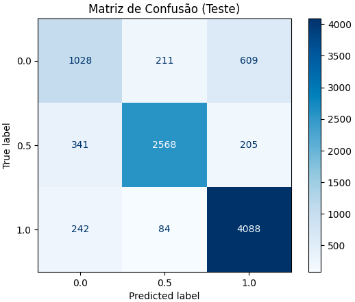
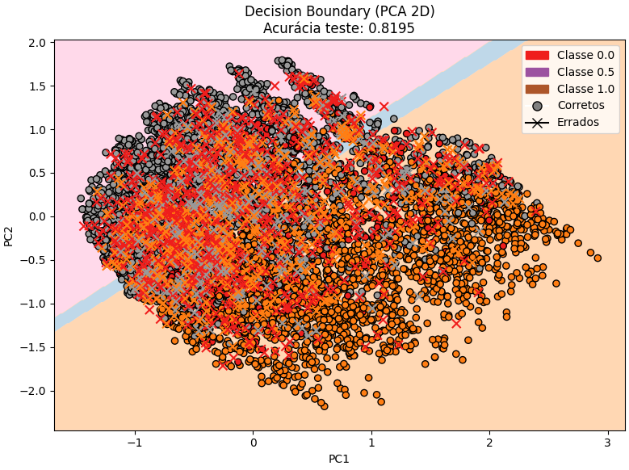

# Classificação com MLP


## Grupo

1. Eduardo Selber Castanho
2. Henrique Fazzio Badin
3. Lucas Fernando de Souza Lima

Arquivo Jupyter implementando o MLP .


## 1. Dataset Overview

**Dataset:** [Predict Students' Dropout and Academic Success](https://archive.ics.uci.edu/dataset/697/predict+students+dropout+and+academic+success)  
**Fonte:** UCI Machine Learning Repository  
**Domínio:** Educação / Ciências Sociais  
**Tipo de dados:** Tabular (numéricos, categóricos e inteiros)  
**Tarefa:** Classificação multiclasse (3 classes: *dropout*, *enrolled*, *graduate*)  
**Amostras:** 4.424  
**Features:** 36  
**Descrição:**  
Dados de estudantes de graduação em diversas áreas, contendo informações demográficas, socioeconômicas e de desempenho acadêmico nos dois primeiros semestres. O objetivo é prever a situação final do aluno — evasão, matrícula ativa ou graduação.  

**Motivação:** O **Predict Students' Dropout and Academic Success** foi escolhido por ser também utilizado em uma [competição no Kaggle](https://www.kaggle.com/competitions/academic-success-classifier/data), o que reforça sua relevância e permite comparações de desempenho entre diferentes abordagens de classificação.  

Além disso, trata-se de um tema **socialmente importante**, pois os resultados obtidos podem ser aplicados em **escolas, universidades e instituições educacionais** para identificar precocemente alunos com risco de evasão e orientar estratégias de apoio acadêmico.  

O dataset é **robusto** (mais de 4.000 instâncias e 36 variáveis) e, ao mesmo tempo, **bem estruturado**, com dados **limpos e sem valores ausentes ou duplicados**, além de **descrições claras das features**, o que facilita o desenvolvimento e análise de modelos de aprendizado de máquina.  


## 2. Dataset Explanation

O conjunto de dados **Predict Students’ Dropout and Academic Success** contém informações acadêmicas, demográficas e socioeconômicas de estudantes de cursos de graduação, coletadas no momento da matrícula e ao final dos dois primeiros semestres.  
O objetivo é prever o **status final do aluno** — *dropout*, *enrolled* ou *graduate* — configurando um problema de **classificação multiclasse**.  

O dataset possui **36 variáveis** e **4.424 instâncias**, todas **sem valores nulos ou duplicados**. As features incluem dados pessoais, histórico acadêmico, desempenho em disciplinas e indicadores macroeconômicos.  


### 2.1 Feature Description

| **Feature** | **Tipo** | **Descrição** | **Valores / Intervalos** |
|:-------------|:----------|:---------------|:--------------------------|
| Marital Status | Integer | Estado civil | 1–single, 2–married, 3–widower, 4–divorced, 5–facto union, 6–legally separated |
| Application mode | Integer | Tipo de candidatura ao curso | 1–general, 5–special contingent, 17–2nd phase, etc. |
| Application order | Integer | Ordem de preferência da candidatura | 0–9 |
| Course | Integer | Curso matriculado | Vários códigos (ex.: 9147–Management, 9500–Nursing) |
| Daytime/evening attendance | Integer | Turno | 1–daytime, 0–evening |
| Previous qualification | Integer | Nível de escolaridade anterior | 1–secondary, 2–higher ed., etc. |
| Previous qualification (grade) | Continuous | Nota da qualificação anterior | 0–200 |
| Nationality | Integer | Nacionalidade | Ex.: 1–Portuguese, 41–Brazilian, 21–Angolan |
| Mother’s qualification | Integer | Escolaridade da mãe | 1–secondary, 5–doctorate, etc. |
| Father’s qualification | Integer | Escolaridade do pai | 1–secondary, 5–doctorate, etc. |
| Mother’s occupation | Integer | Ocupação da mãe | 0–student, 1–manager, 5–service worker, etc. |
| Father’s occupation | Integer | Ocupação do pai | 0–student, 1–manager, 8–technician, etc. |
| Admission grade | Continuous | Nota de admissão no curso | 0–200 |
| Displaced | Integer | Mora fora da cidade de origem | 1–yes, 0–no |
| Educational special needs | Integer | Necessidades educacionais especiais | 1–yes, 0–no |
| Debtor | Integer | Está em débito financeiro | 1–yes, 0–no |
| Tuition fees up to date | Integer | Mensalidades em dia | 1–yes, 0–no |
| Gender | Integer | Sexo do estudante | 1–male, 0–female |
| Scholarship holder | Integer | Possui bolsa de estudos | 1–yes, 0–no |
| Age at enrollment | Integer | Idade no momento da matrícula | anos |
| International | Integer | Estudante internacional | 1–yes, 0–no |
| Curricular units 1st sem (credited) | Integer | Disciplinas creditadas (1º semestre) | 0–n |
| Curricular units 1st sem (enrolled) | Integer | Disciplinas matriculadas (1º semestre) | 0–n |
| Curricular units 1st sem (evaluations) | Integer | Avaliações realizadas (1º semestre) | 0–n |
| Curricular units 1st sem (approved) | Integer | Disciplinas aprovadas (1º semestre) | 0–n |
| Curricular units 1st sem (grade) | Integer | Média de notas (1º semestre) | 0–20 |
| Curricular units 1st sem (without evaluations) | Integer | Disciplinas sem avaliação (1º semestre) | 0–n |
| Curricular units 2nd sem (credited) | Integer | Disciplinas creditadas (2º semestre) | 0–n |
| Curricular units 2nd sem (enrolled) | Integer | Disciplinas matriculadas (2º semestre) | 0–n |
| Curricular units 2nd sem (evaluations) | Integer | Avaliações realizadas (2º semestre) | 0–n |
| Curricular units 2nd sem (approved) | Integer | Disciplinas aprovadas (2º semestre) | 0–n |
| Curricular units 2nd sem (grade) | Integer | Média de notas (2º semestre) | 0–20 |
| Curricular units 2nd sem (without evaluations) | Integer | Disciplinas sem avaliação (2º semestre) | 0–n |
| Unemployment rate | Continuous | Taxa de desemprego (%) | valor contínuo |
| Inflation rate | Continuous | Taxa de inflação (%) | valor contínuo |
| GDP | Continuous | Produto Interno Bruto | valor contínuo |
| **Target** | Categorical | Situação final do aluno | *Dropout*, *Enrolled*, *Graduate* |

### 2.2 Target Variable

A variável **Target** representa a situação final do estudante ao término do curso:

- **Dropout (0):** o aluno abandonou o curso  
- **Enrolled (1):** o aluno ainda está matriculado  
- **Graduate (2):** o aluno concluiu o curso com sucesso

### 2.3 Data Issues

O dataset já foi **pré-processado e limpo** pelos autores originais, não apresentando:

- Valores ausentes (`NaN`);
- Duplicatas;
- Outliers sem explicação evidente.  

## 3. Data Cleaning and Normalization

A etapa de **limpeza e normalização** foi realizada para garantir a qualidade dos dados e preparar o conjunto para o treinamento da rede MLP. O processo incluiu inspeção inicial, remoção de outliers, codificação de variáveis categóricas, normalização numérica e análise exploratória com **PCA (Principal Component Analysis)**.

### 3.1 Initial Inspection

Após o carregamento do dataset (`train.csv`), foi feita uma análise exploratória inicial com `pandas` e `matplotlib` para verificar estrutura, tipos de dados e possíveis problemas de consistência.

```python
df.info()
df.isnull().sum()
df.describe().transpose()
df.hist(bins=30, figsize=(20, 15))
```

* Nenhum valor nulo foi encontrado.
* Não há colunas duplicadas.
* As distribuições mostram amplitudes diferentes entre variáveis, o que justifica a posterior normalização.

**Figura 1 — Distribuição inicial das features**


### 3.2 Outlier Detection and Removal

Foram definidos **limites manuais de plausibilidade** (*bounds*) para cada variável quantitativa, baseados em conhecimento de domínio e na distribuição dos dados. A função `remove_outliers_by_bounds()` filtrou linhas fora desses intervalos.

```python
df_sem_outliers = remove_outliers_by_bounds(df)
```

#### Principais resultados:

| Variável                                       | Intervalo Mantido | Linhas Removidas |
| :--------------------------------------------- | :---------------- | :--------------- |
| Previous qualification (grade)                 | [80, 180]         | 13               |
| Admission grade                                | [90, 180]         | 16               |
| Age at enrollment                              | [16, 60]          | 33               |
| Curricular units 1st sem (approved)            | [0, 15]           | 108              |
| Curricular units 1st sem (without evaluations) | [0, 4]            | 127              |
| Curricular units 2nd sem (without evaluations) | [0, 1]            | 1.011            |
| Inflation rate                                 | [-1.5, 3.5]       | 7.327            |
| GDP                                            | [-4.5, 3.5]       | 5.082            |

**Resumo final:** 76.518 → 62.502 linhas após limpeza.

**Figura 2 — Distribuição após remoção de outliers**


A filtragem removeu registros com valores extremos (principalmente em indicadores macroeconômicos e notas médias), reduzindo ruídos sem comprometer o volume de dados.

### 3.3 Feature Encoding

Para transformar variáveis categóricas em numéricas, foi aplicada **codificação one-hot** com `pandas.get_dummies()`, preservando todas as categorias:

```python
df_encoded = pd.get_dummies(df, columns=[
    "Nacionality", "Marital status", "Application mode", "Course",
    "Previous qualification", "Mother's qualification", "Father's qualification",
    "Mother's occupation", "Father's occupation"
])
```

* As novas colunas (`uint8`) representaram corretamente cada categoria.
* O `Target` foi mapeado para valores numéricos:

* `Graduate = 1.0`
* `Dropout = 0.5`
* `Enrolled = 0.0`

### 3.4 Normalization

Como as features possuem escalas diferentes (por exemplo, notas entre 0–200 e idades entre 16–60), aplicou-se a **normalização Min–Max**, escalando todos os valores para o intervalo [0, 1]:

```python
from sklearn.preprocessing import MinMaxScaler
scaler = MinMaxScaler()
df_scaled[numeric_cols] = scaler.fit_transform(df_encoded[numeric_cols])
```

Essa transformação assegura que todas as variáveis tenham o mesmo peso relativo no cálculo dos gradientes durante o treinamento do MLP.


### 3.5 Dimensionality Reduction (PCA)

Por fim, aplicou-se uma **Análise de Componentes Principais (PCA)** para verificar a variância explicada e explorar a separabilidade entre classes.

```python
from sklearn.decomposition import PCA
pca = PCA(n_components=2)
pca_result = pca.fit_transform(df_scaled[numeric_cols])
```

* **PC1:** 34% da variância explicada
* **PC2:** 21% da variância explicada
* **Total:** ~55% da variância capturada pelos dois primeiros componentes

**Figura 3 — PCA (PC1 vs PC2) colorido por classe**


### 3.6 Summary

* Nenhum dado ausente ou duplicado encontrado.
* Outliers removidos com base em limites definidos manualmente.
* Variáveis categóricas convertidas por one-hot encoding.
* Normalização Min–Max aplicada a todas as variáveis numéricas.

## 4. MLP Implementation

Para a implementação do MLP consideramos decisões de design sobre arquitetura, funções de ativação, função de perda, inicialização de pesos e hiperparâmetros. A implementação foi feita em **NumPy** para reforçar a compreensão das operações fundamentais (forward, loss, backprop e atualização de pesos). Em seguida detalhamos cada componente.

### 4.1 Network Architecture

Optou-se por um MLP com duas camadas ocultas:

* **Input:** dimensão `D` (número de features após one-hot + normalização).
* **Hidden layer 1:** `H1 = 64` neurônios, ativação `tanh`.
* **Hidden layer 2:** `H2 = 32` neurônios, ativação `tanh`.
* **Output:** `K` neurônios (número de classes), ativação `softmax`.

Justificativa curta:

* Duas camadas ocultas capturam não linearidades mais complexas que uma única camada sem tornar a rede excessivamente profunda.
* H1/H2 escolhidos por experimentação empírica: aumentos significativos na largura não trouxeram ganhos relevantes, apenas custo computacional.

### 4.2 Activation Functions

* **Camadas ocultas:** `tanh`

  * Vantagem: saída centrada em zero, derivada simples (`1 - tanh^2`) e bom comportamento com inicializações escalonadas.
  * Observação: `ReLU` pode acelerar convergência, mas neste trabalho mantivemos `tanh` por estabilidade e por corresponder ao material do curso.
* **Camada de saída:** `softmax`

  * Produz probabilidades normalizadas por amostra, adequada para cross-entropy multiclasses.

### 4.3 Loss Function

* **Cross-entropy (categorical)** combinada com **regularização L2** aplicada a todos os pesos:

  [
  \text{loss} = -\frac{1}{B}\sum_{i=1}^{B} \sum_{k=1}^{K} y_{ik}\log(\hat{y}*{ik}) ;+; \lambda \sum*{\ell} |W^{(\ell)}|^2
  ]

  * `B` é o tamanho do mini-batch.
  * A combinação cross-entropy + softmax simplifica a derivada do output para `(yhat - y_onehot)/B`, o que facilita o cálculo de gradientes.

* **Motivação:** cross-entropy penaliza previsões confiantes e erradas de forma mais forte que MSE, sendo padrão em classificação probabilística.

### 4.4 Hyperparameters

Hiperparâmetros selecionados (valores usados nos experimentos):

* **Learning Rate (lr):** `0.005`

  * Testes com 0.001, 0.005 e 0.01 indicaram que 0.005 entregou bom equilíbrio entre velocidade e estabilidade com `tanh`.
* **Epochs (máx):** `500`

  * Limite superior; o treinamento é interrompido via **early stopping** quando a validação não melhora.
* **Batch size:** `64`

  * Atualização mais frequente que `128`, com bom trade-off entre estabilidade do gradiente e variação estocástica útil.
* **Regularization (L2):** `lambda_l2 = 1e-4`

  * Penalização leve que reduz overfitting sem prejudicar aprendizagem.
* **Patience (early stopping):** `15` épocas sem melhora em `val_loss`.
* **Inicialização de pesos:** normal padrão com escala `1/sqrt(fan_in)`:

  * ex.: `W = rng.normal(0,1,(out,in)) / sqrt(in)` — reduz saturação inicial e ajuda na estabilidade do treino.
* **Seed / reproducibility:** `np.random.default_rng(42)` e `random_state=42` nos splits.

Ajustes e recomendações:

* Para acelerar convergência pode-se testar `ReLU + Adam` (optimizers modernos) e `batch normalization`.
* Para lidar com desbalanceamento usar `class_weight` no loss ou técnicas de oversampling (SMOTE).

### 4.5 Implementation Details

A implementação do MLP foi feita inteiramente em **NumPy**, permitindo controle direto sobre cada etapa — forward pass, cálculo da função de perda, retropropagação e atualização dos parâmetros. Essa abordagem possibilita compreender o fluxo interno de dados e gradientes, sem a abstração de frameworks como PyTorch ou TensorFlow.

Para referência, as etapas de treinamento seguiram o fluxo do material de *Numerical Simulation* do curso, dividido em:

1. **Forward Pass:** os dados são propagados camada a camada;
2. **Loss Calculation:** cálculo da cross-entropy e penalização L2;
3. **Backward Pass:** propagação reversa dos gradientes para ajustar pesos e vieses.

```python
# Forward Pass (propagação)
z1 = xb @ W1.T + b1; h1 = tanh(z1)
z2 = h1 @ W2.T + b2; h2 = tanh(z2)
z3 = h2 @ W3.T + b3; yhat = softmax(z3)

# Cálculo da Loss (cross-entropy + L2)
loss_ce = -np.mean(np.sum(yb * np.log(yhat + 1e-9), axis=1))
l2_term = lambda_l2 * (np.sum(W1*W1) + np.sum(W2*W2) + np.sum(W3*W3))
loss = loss_ce + l2_term

# Backpropagation
d3 = (yhat - yb) / B
gW3 = d3.T @ h2 + 2*lambda_l2*W3
gb3 = d3.sum(axis=0)

dh2 = d3 @ W3
dz2 = dh2 * (1 - h2**2)
gW2 = dz2.T @ h1 + 2*lambda_l2*W2
gb2 = dz2.sum(axis=0)

dh1 = dz2 @ W2
dz1 = dh1 * (1 - h1**2)
gW1 = dz1.T @ xb + 2*lambda_l2*W1
gb1 = dz1.sum(axis=0)

# Atualização dos parâmetros
W3 -= lr * gW3; b3 -= lr * gb3
W2 -= lr * gW2; b2 -= lr * gb2
W1 -= lr * gW1; b1 -= lr * gb1
```

Durante o treinamento, foram adotadas três práticas fundamentais:

* **Mini-Batch Training:** processa subconjuntos de amostras, aumentando a eficiência e introduzindo ruído estocástico que ajuda na generalização.
* **Regularização L2:** evita overfitting penalizando pesos muito grandes.
* **Early Stopping:** interrompe o treino se a perda de validação (`val_loss`) não melhorar após 15 épocas consecutivas, preservando o modelo ótimo.

#### Monitoramento de métricas

Durante as épocas, foram registrados vetores de perda e acurácia para treino e validação:

* `train_losses`, `val_losses`
* `train_accs`, `val_accs`

Exemplo dos logs registrados:

```
Época  10 | TrainLoss 0.5499 | ValLoss 0.5394 | TrainAcc 0.793 | ValAcc 0.791
Época 200 | TrainLoss 0.4619 | ValLoss 0.4555 | TrainAcc 0.826 | ValAcc 0.823
Early stopping (época 219) melhor val_loss=0.4528
```

Esses logs mostram uma convergência suave, com perda diminuindo até a época ~200, quando a validação estabiliza, demonstrando equilíbrio entre aprendizado e generalização.

#### Geração das curvas de aprendizado

As curvas de *loss* e *acurácia* foram plotadas para inspeção visual da convergência:

```python
plt.figure(figsize=(10,4))
plt.subplot(1,2,1)
plt.plot(train_losses, label="Train Loss")
plt.plot(val_losses, label="Val Loss")
plt.xlabel("Época"); plt.ylabel("Loss"); plt.title("Curva de Loss")
plt.legend()

plt.subplot(1,2,2)
plt.plot(train_accs, label="Train Acc")
plt.plot(val_accs, label="Val Acc")
plt.xlabel("Época"); plt.ylabel("Acurácia"); plt.title("Curva de Acurácia")
plt.legend()
plt.tight_layout()
plt.show()
```

Esses gráficos permitem verificar se há overfitting (divergência entre treino e validação) ou underfitting (valores de perda altos e estáveis).

#### Avaliação e checkpoint

Ao final do treino:

* O modelo é restaurado para os pesos do melhor *checkpoint* (menor `val_loss`);
* Avaliado no conjunto de teste com métricas: **acurácia, precisão, recall e F1-score**;
* Uma **matriz de confusão** é gerada para análise dos erros;
* O **decision boundary** é visualizado no espaço 2D via PCA.


## 5. Model Training

### 5.1 Training Setup

* Dados já codificados e escalados (MinMax).
* Split feito com `stratify` para preservar proporções de classe (70% train / 15% val / 15% test).
* Shuffle por época com `rng.permutation`.

### 5.2 Training Loop (resumo)

* Para cada época:

  * embaralha treino;
  * itera por mini-batches;
  * forward → calcula `loss` (+ L2) → backward → atualiza parâmetros;
  * ao fim da época calcula `train_loss`, `val_loss`, `train_acc`, `val_acc`.
* Early stopping: interrompe se `val_loss` não melhorar por `patience` épocas.

Trechos chave (exemplo do forward, loss e update):

```python
# forward (mini-batch)
z1 = xb @ W1.T + b1; h1 = tanh(z1)
z2 = h1 @ W2.T + b2; h2 = tanh(z2)
z3 = h2 @ W3.T + b3; yhat = softmax(z3)

# loss CE + L2
loss_ce = -np.mean(np.sum(yb * np.log(yhat + 1e-9), axis=1))
l2_term = lambda_l2 * (np.sum(W1*W1) + ...)
loss = loss_ce + l2_term

# backward (resumo)
d3 = (yhat - yb) / B
gW3 = d3.T @ h2 + 2*lambda_l2*W3
... # calcula gW2,gW1 e gb*

# update
W3 -= lr * gW3
...
```

### 5.3 Training Observations (logs)

Trechos de log produzidos durante treinamento:

```
Época   1 | TrainLoss 0.9766 | ValLoss 0.8791 | TrainAcc 0.654 | ValAcc 0.653
Época  10 | TrainLoss 0.5499 | ValLoss 0.5394 | TrainAcc 0.793 | ValAcc 0.791
...
Época 210 | TrainLoss 0.4615 | ValLoss 0.4534 | TrainAcc 0.825 | ValAcc 0.823
Early stopping (época 219) melhor val_loss=0.4528
```

* Observa-se **rápida convergência** nas primeiras 50 épocas; depois estabilização com pequenas melhorias.
* Early stopping ao redor de ~219 épocas.


## 6. Training and Testing Strategy

### 6.1 Data Split

* `train / val / test = 70% / 15% / 15%` com **stratify** para preservar distribuição de classes.

### 6.2 Validation Strategy

* Validação simples (conjunto de validação dedicado) usada para seleção de hiperparâmetros e early stopping.

### 6.3 Reproducibility

* Seed fixada via `np.random.default_rng(42)` e `random_state=42` nos `train_test_split`.

### 6.4 Overfitting Prevention

* Regularização L2 em todos os pesos.
* Early stopping baseado em `val_loss`.
* Batch training (mini-batch) fornece ruído útil ao otimizar.


## 7. Error Curves and Visualization

### 7.1 Loss and Accuracy Curves

**Figura:** Curva de Loss e Acurácia (treino vs validação).


### 7.2 Analysis of Learning Behavior

* Treino e validação converge próximos e sem divergência acentuada → **overfitting limitado** graças a L2 + early stopping.
* Acurácia de validação estabilizou ~0.823, indicando bom ajuste do modelo.


## 8. Evaluation Metrics

### 8.1 Test Metrics (resultado final)

Resultados calculados no conjunto de **teste**:

```
MÉTRICAS TESTE
Acurácia : 0.8195
Precisão : 0.7897
Recall   : 0.7690
F1-score : 0.7771
```

### 8.2 Baseline (majority class)

Classe majoritária no teste: `2` Baseline (predizer sempre a classe majoritária):

```
MÉTRICAS BASELINE (Majority Class)
Acurácia : 0.4708
Precisão : 0.1569
Recall   : 0.3333
F1-score : 0.2134
```

**Comparação:** o MLP supera claramente o baseline em todas as métricas (ex.: acurácia 0.8195 vs 0.4708).

### 8.3 Confusion Matrix

**Figura:** Matriz de Confusão (Teste):



**Classe "Graduate (1.0)"**  
O modelo obteve o melhor desempenho nesta classe, com **4088 acertos** e **poucos erros de confusão**.  
Representa também a **classe majoritária**, o que explica a facilidade de identificação.  
Poucos graduados foram confundidos como “Dropout” (242) ou “Enrolled” (84).

**Classe "Enrolled (0.5)"**  
A segunda melhor classe em termos de acerto (**2568 corretos**).  
Alguns alunos ainda matriculados foram incorretamente classificados como “Dropout” (**341**) — possivelmente devido a perfis de desempenho inicial similares.  
Menor confusão com “Graduate” (**205**) indica que o modelo diferencia razoavelmente alunos ativos dos formados.

**Classe "Dropout (0.0)"**  
A classe mais **problemática**: apenas **1028 acertos** contra **820 erros (211+609)**.  
Quase **600 alunos que abandonaram o curso** foram classificados como “Graduate” — mostrando que o modelo tem **dificuldade em detectar evasão**, o que é crítico neste tipo de aplicação.  
Essa confusão indica que **o modelo tende a superestimar o sucesso acadêmico**, possivelmente por conta do desbalanceamento do dataset.


### 8.4 Decision Boundary (PCA 2D)

**Figura:** Decisão no espaço PCA (PC1 × PC2) com pontos corretos/errados do conjunto de teste.




## 9. Conclusion

### 9.1 Key Findings

* MLP implementado do zero (NumPy) atingiu **Acurácia = 0.8195** e **F1 ≈ 0.7771** no conjunto de teste, superando largamente o baseline majoritário.
* PCA mostrou separação parcial entre classes, justificando uso de modelo não-linear (MLP).

### 9.2 Limitations

* Desbalanceamento de classes requer análise adicional (class weighting, oversampling/undersampling).
* Remoção de outliers foi feita por limites manuais — abordagem automática (IQR, isolation forest) poderia ser comparada.
* Implementação atual usa `tanh`; testar `ReLU` + batchnorm pode acelerar/aperfeiçoar treino.

## Appendix — Código de Treino e Avaliação

Arquivo Jupyter implementando o MLP .


